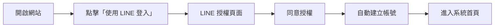
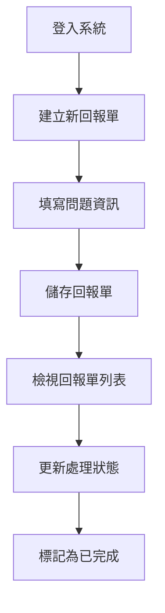

# ClarityDesk 使用者操作手冊

**版本**: 1.0  
**發佈日期**: 2025年10月21日  
**適用對象**: 所有 ClarityDesk 使用者

---

## 目錄

1. [系統簡介](#系統簡介)
2. [快速開始](#快速開始)
3. [登入系統](#登入系統)
4. [LINE 整合功能](#line-整合功能)
   - [綁定 LINE 官方帳號](#綁定-line-官方帳號)
   - [接收回報單推送通知](#接收回報單推送通知)
   - [在 LINE 中回報問題](#在-line-中回報問題)
5. [回報單管理](#回報單管理)
   - [檢視回報單列表](#檢視回報單列表)
   - [建立新回報單](#建立新回報單)
   - [檢視回報單詳情](#檢視回報單詳情)
   - [編輯回報單](#編輯回報單)
   - [刪除回報單](#刪除回報單)
   - [篩選與搜尋](#篩選與搜尋)
6. [系統管理功能](#系統管理功能-僅限管理人員)
   - [使用者權限管理](#使用者權限管理)
   - [問題所屬單位維護](#問題所屬單位維護)
   - [LINE 管理功能](#line-管理功能)
7. [常見問題](#常見問題)
8. [聯絡支援](#聯絡支援)

---

## 系統簡介

ClarityDesk 是一個專為快速記錄與追蹤顧客問題而設計的管理系統。無論您是客服人員、技術支援還是業務人員,都可以透過簡潔直觀的介面,快速建立問題記錄並進行後續追蹤。

### 主要功能

- **快速記錄**: 透過簡化的表單快速建立顧客問題記錄
- **智慧篩選**: 支援多條件篩選,快速找到特定的回報單
- **狀態追蹤**: 清楚追蹤每個問題的處理進度
- **權限管理**: 管理人員可以管理使用者權限與系統設定
- **LINE 登入**: 使用 LINE 帳號快速登入,無需記憶額外帳號密碼
- **LINE 整合功能**: 
  - 綁定 LINE 官方帳號,接收即時推送通知
  - 處理人員在 LINE 收到新回報單通知
  - 直接在 LINE 對話中回報問題

### 系統需求

- **瀏覽器**: Chrome、Firefox、Edge、Safari 最新兩個版本
- **網路**: 穩定的網際網路連線
- **LINE 帳號**: 需有有效的 LINE 帳號以進行登入

### 使用者角色

ClarityDesk 提供兩種使用者角色:

| 角色 | 權限說明 |
|------|----------|
| **普通使用者** | 可建立、檢視、編輯、刪除回報單,以及使用篩選功能 |
| **管理人員** | 除了普通使用者的所有權限外,還可管理使用者權限與問題所屬單位 |

---

## 快速開始

### 首次使用流程



1. 開啟 ClarityDesk 網站
2. 點擊「使用 LINE 登入」按鈕
3. 在 LINE 授權頁面點擊「同意」
4. 系統自動建立您的帳號並登入
5. 開始使用!

### 基本操作流程

一個典型的使用情境如下:



---

## 登入系統

### 使用 LINE 登入

1. **開啟登入頁面**
   - 訪問 ClarityDesk 網站首頁
   - 若尚未登入,系統會自動導向登入頁面

2. **進行 LINE 授權**
   - 點擊綠色的「使用 LINE 登入」按鈕
   - 瀏覽器會跳轉到 LINE 授權頁面

3. **同意授權**
   - 確認授權的權限項目
   - 點擊「同意」按鈕

4. **自動登入**
   - 首次登入:系統會自動建立您的帳號(預設為「普通使用者」角色)
   - 再次登入:直接登入並導向系統首頁

### 登入後的畫面

登入成功後,您會看到:

- **導航列**: 位於頁面頂端,包含主要功能選單
- **使用者資訊**: 右上角顯示您的 LINE 頭像與名稱
- **首頁**: 顯示最近的回報單統計資訊

### 登出系統

若需要登出系統:

1. 點擊右上角的使用者名稱或頭像
2. 選擇「登出」選項
3. 系統會清除登入狀態並導向登入頁面

---

## LINE 整合功能

ClarityDesk 整合了 LINE 官方帳號,提供三大核心功能:帳號綁定、即時推送通知與 LINE 端回報問題。透過 LINE 整合,處理人員可以即時掌握新的回報單,使用者也可以在 LINE 中快速回報問題,大幅提升工作效率與使用便利性。

### 綁定 LINE 官方帳號

#### 功能說明

綁定 LINE 官方帳號後,您可以:
- 在 LINE 接收新回報單的即時推送通知(若您是處理人員)
- 直接在 LINE 對話中回報問題
- 快速查看回報單詳情

> **注意**: 訪客帳號無法使用 LINE 綁定功能,需先使用 LINE Login 註冊正式帳號。

#### 如何綁定

1. **進入綁定頁面**
   - 登入系統後,點擊右上角的使用者名稱或頭像
   - 選擇「LINE 綁定管理」
   - 或從個人設定頁面進入

2. **掃描 QR Code**
   - 頁面會顯示 LINE 官方帳號的 QR Code
   - 使用 LINE App 掃描 QR Code
   - 或點擊「在 LINE 中開啟」按鈕(行動裝置)

3. **加入好友**
   - 在 LINE 中點擊「加入」按鈕
   - 加入 ClarityDesk 官方帳號為好友

4. **完成綁定**
   - 返回網頁頁面
   - 系統會自動偵測綁定完成
   - 顯示「已綁定」狀態及您的 LINE 顯示名稱

#### 綁定狀態說明

| 狀態 | 說明 | 可用功能 |
|------|------|----------|
| **已綁定** | 已成功綁定 LINE 官方帳號 | 接收推送通知、LINE 端回報 |
| **未綁定** | 尚未綁定 | 僅可使用網頁端功能 |
| **已封鎖** | 在 LINE 中封鎖了官方帳號 | 推送通知失敗 |

#### 如何解除綁定

若需要解除綁定:

1. 進入「LINE 綁定管理」頁面
2. 點擊「解除綁定」按鈕
3. 在確認對話框中點擊「確定」
4. 系統會移除綁定關係
5. 在 LINE 中也需手動封鎖或刪除官方帳號好友

> **提示**: 解除綁定後將無法接收推送通知與使用 LINE 端回報功能。

### 接收回報單推送通知

#### 功能說明

當您被指派為回報單的處理人員時,系統會自動透過 LINE 推送通知給您,讓您可以即時掌握新的問題回報。

#### 前置條件

- ✅ 您的帳號已綁定 LINE 官方帳號
- ✅ 您被設定為某單位的預設處理人員
- ✅ 有新的回報單指派給您

#### 推送通知內容

LINE 推送訊息會包含以下完整資訊:

- 📋 **回報單編號**: 例如 `#12345`
- 📝 **問題標題**: 問題的簡短描述
- 🔴 **緊急程度**: 高 / 中 / 低 (以表情符號標示)
- 🏢 **問題所屬單位**: 例如「客服部」
- 👤 **聯絡人**: 顧客姓名
- ☎️ **連絡電話**: 顧客電話號碼
- 📅 **紀錄日期**: 回報單建立時間
- 👨‍💼 **回報人**: 建立此回報單的人員

#### 快速操作

推送訊息底部會提供「查看回報單詳情」按鈕:

1. 點擊按鈕後會在 LINE 內建瀏覽器開啟回報單詳細頁面
2. 連結包含時效性安全 Token(24 小時有效)
3. 您可以直接在頁面中查看完整資訊、編輯或更新狀態

#### 訊息範例

```
🔔 新的回報單通知

回報單編號: #12345
問題標題: 系統登入異常

📌 基本資訊
緊急程度: 🔴 高
問題所屬單位: 技術部
紀錄日期: 2025-10-24 14:30

👤 聯絡資訊
聯絡人: 王小明
連絡電話: 0912-345-678

👨‍💼 回報人: 張大華

[查看回報單詳情]
```

#### 常見問題

**Q: 為什麼我沒有收到推送通知?**

可能原因:
- 您的 LINE 帳號尚未綁定
- 您的綁定狀態為「已封鎖」
- 回報單未指派給您
- LINE 官方帳號已達到每月推送配額限制(免費方案 500 則)

**Q: 推送訊息的連結無法開啟?**

可能原因:
- 連結已過期(超過 24 小時)
- 網路連線問題
- 解決方法: 重新從網頁端登入系統查看回報單

### 在 LINE 中回報問題

#### 功能說明

已綁定 LINE 的使用者可以直接在 LINE 對話中透過互動式流程回報問題,無需開啟網頁,大幅提升便利性。系統會引導您逐步填寫必要資訊,並自動建立回報單。

#### 如何開始回報

1. **開啟對話**
   - 在 LINE 中開啟 ClarityDesk 官方帳號的聊天室

2. **觸發回報流程**
   - 傳送訊息:「回報問題」
   - 或點擊快速選單中的「回報問題」按鈕(若有設定)

3. **依序填寫資訊**
   - 系統會引導您逐步輸入以下資訊:

#### 回報流程步驟

| 步驟 | 說明 | 範例 |
|------|------|------|
| 1️⃣ **問題標題** | 簡短描述問題(必填) | 「電腦無法開機」 |
| 2️⃣ **問題內容** | 詳細說明問題狀況(必填) | 「按下電源鍵後沒有任何反應,螢幕完全沒有畫面」 |
| 3️⃣ **問題所屬單位** | 點選快速回覆按鈕選擇單位(必填) | 「技術部」 |
| 4️⃣ **緊急程度** | 點選快速回覆按鈕選擇(必填) | 「🔴 高」 |
| 5️⃣ **聯絡人** | 輸入顧客姓名(必填) | 「王小明」 |
| 6️⃣ **連絡電話** | 輸入顧客電話(必填) | 「0912-345-678」 |

#### 資料驗證

系統會自動驗證您輸入的資料:

- **電話號碼格式**: 必須符合台灣手機或市話格式
  - 手機: `09XX-XXX-XXX` 或 `09XXXXXXXX`
  - 市話: `0X-XXXX-XXXX` 或 `0XXXXXXXX`
- **必填欄位**: 所有欄位皆為必填,不可留空
- **格式錯誤處理**: 若格式不正確,系統會提示錯誤訊息並要求重新輸入

#### 確認與送出

1. **檢視摘要**
   - 完成所有欄位後,系統會顯示摘要供您確認
   - 摘要包含所有填寫的資訊與系統自動填入的資訊:
     - 紀錄日期: 當前時間
     - 回報人: 您的使用者名稱
     - 處理狀態: 待處理
     - 指派處理人員: 根據所屬單位自動指派

2. **選擇操作**
   - 點擊「確認送出」→ 建立回報單
   - 點擊「重新填寫」→ 清除資料重新開始
   - 點擊「取消」→ 中斷流程

3. **完成回報**
   - 系統建立回報單後會回覆:
     - 回報單編號
     - 查看回報單的連結
   - 回報單立即同步至網頁端系統

#### 互動式流程範例

```
使用者: 回報問題

ClarityDesk Bot: 
好的,我將協助您建立問題回報單。
請輸入「問題標題」(簡短描述問題):

使用者: 印表機無法列印

ClarityDesk Bot:
已記錄標題。
請輸入「問題內容」(詳細說明):

使用者: 送出列印工作後沒有反應,印表機燈號正常

ClarityDesk Bot:
請選擇「問題所屬單位」:
[技術部] [客服部] [業務部]

使用者: (點選) 技術部

ClarityDesk Bot:
請選擇「緊急程度」:
[🔴 高] [🟡 中] [🟢 低]

使用者: (點選) 🟡 中

ClarityDesk Bot:
請輸入「聯絡人」(顧客姓名):

使用者: 李小華

ClarityDesk Bot:
請輸入「連絡電話」:

使用者: 0987-654-321

ClarityDesk Bot:
📋 請確認您的回報資訊:

問題標題: 印表機無法列印
問題內容: 送出列印工作後沒有反應,印表機燈號正常
問題所屬單位: 技術部
緊急程度: 🟡 中
聯絡人: 李小華
連絡電話: 0987-654-321

📌 系統自動填入:
紀錄日期: 2025-10-24 15:20
回報人: 張三
處理狀態: 待處理
指派處理人員: 王工程師

請選擇:
[確認送出] [重新填寫] [取消]

使用者: (點選) 確認送出

ClarityDesk Bot:
✅ 回報單已成功建立!

回報單編號: #12346
您可以點擊下方連結查看詳情:
[查看回報單 #12346]

感謝您的回報,我們會盡快處理。
```

#### 注意事項

⚠️ **會話逾時**: 
- 對話流程會在 30 分鐘後自動逾時
- 逾時後需重新開始回報流程
- 系統會在 20 分鐘時提醒您

⚠️ **中斷流程**:
- 在任何步驟輸入「取消」可中斷流程
- 已輸入的資料會被清除

⚠️ **推送通知**:
- LINE 端建立的回報單與網頁端功能完全相同
- 指派的處理人員同樣會收到 LINE 推送通知(若已綁定)

#### 常見問題

**Q: 如何修改已填寫的資訊?**

A: 在確認摘要頁面點擊「重新填寫」,即可清除資料重新開始。若已送出,則需至網頁端編輯回報單。

**Q: 為什麼我無法使用 LINE 回報功能?**

A: 請確認:
- 您的 LINE 帳號已綁定 ClarityDesk
- 您不是訪客帳號
- 您的綁定狀態為「已綁定」,而非「已封鎖」

**Q: LINE 回報的資料會同步到網頁端嗎?**

A: 是的,LINE 端建立的回報單會立即同步至網頁端系統,您可以在回報單列表中看到,且會標註來源為「LINE」。

---

## 回報單管理

回報單是 ClarityDesk 的核心功能,讓您可以快速記錄並追蹤顧客問題。

### 檢視回報單列表

1. **進入列表頁面**
   - 點擊導航列的「回報單管理」
   - 或直接從首頁點擊「檢視所有回報單」

2. **列表資訊**

   列表頁面會顯示所有回報單,包含以下資訊:

   | 欄位 | 說明 |
   |------|------|
   | 標題 | 問題的簡短標題 |
   | 緊急程度 | 以顏色標示 - 🔴高 / 🟠中 / 🟢低 |
   | 處理狀態 | 待處理 / 處理中 / 已完成 |
   | 回報人 | 建立此回報單的人員 |
   | 建立時間 | 回報單的建立日期與時間 |

3. **排序方式**
   - 預設按建立時間倒序排列(最新的在最上面)
   - 點擊欄位標題可切換排序方式

4. **分頁功能**
   - 每頁顯示 20 筆記錄
   - 使用頁面底部的分頁控制切換頁面

### 建立新回報單

#### 步驟一:進入建立頁面

1. 在回報單列表頁面點擊「新增回報單」按鈕
2. 或在導航列選擇「回報單管理」→「建立新回報單」

#### 步驟二:填寫表單

填寫以下必填欄位(標有 <span style="color: red;">*</span> 符號):

| 欄位名稱 | 說明 | 範例 |
|----------|------|------|
| **標題** * | 問題的簡短描述(50字以內) | 客戶反映商品包裝破損 |
| **內文** * | 問題的詳細說明(2000字以內) | 客戶於今日上午來電表示收到的商品外箱有明顯破損... |
| **紀錄日期** * | 問題發生或記錄的日期 | 2025/10/21 |
| **緊急程度** * | 選擇問題的緊急程度 | 高 / 中 / 低 |
| **處理狀態** * | 目前的處理進度 | 待處理(預設) |
| **問題所屬單位** * | 可選擇多個相關單位 | ☑ 客服部 ☑ 物流部 |
| **指派處理人員** * | 負責處理此問題的人員 | 從下拉選單選擇 |
| **回報人姓名** * | 記錄此問題的人員 | 王小明 |
| **顧客聯絡人姓名** * | 問題相關的顧客姓名 | 李大華 |
| **顧客連絡電話** * | 顧客的聯絡電話 | 0912-345-678 |

#### 欄位填寫說明

**緊急程度選擇建議**:

- **高 (🔴)**: 嚴重影響客戶使用或公司營運,需立即處理
  - 範例:服務中斷、資料遺失、客訴升級
- **中 (🟠)**: 有一定影響但可暫時因應,需盡快處理
  - 範例:功能異常、交貨延遲、一般客訴
- **低 (🟢)**: 影響較小,可依正常流程處理
  - 範例:功能優化建議、文件更新、一般諮詢

**問題所屬單位**:
- 可同時勾選多個單位
- 若不確定,建議選擇主要負責的單位

**指派處理人員**:
- 系統會依您選擇的單位,自動篩選該單位的處理人員
- 可選擇任一註冊使用者

#### 步驟三:儲存回報單

1. 填寫完所有必填欄位後,點擊「儲存」按鈕
2. 系統會進行以下驗證:
   - ✓ 必填欄位是否都已填寫
   - ✓ 電話格式是否正確
   - ✓ 日期格式是否有效
3. 驗證通過後,系統會:
   - 自動記錄建立時間
   - 顯示成功訊息
   - 導向回報單詳情頁面

#### 常見錯誤處理

| 錯誤訊息 | 原因 | 解決方法 |
|----------|------|----------|
| "標題為必填欄位" | 未填寫標題 | 請輸入問題的簡短描述 |
| "請選擇至少一個單位" | 未勾選問題所屬單位 | 至少勾選一個相關單位 |
| "電話格式不正確" | 電話格式不符 | 請輸入有效的電話號碼格式 |

### 檢視回報單詳情

#### 進入詳情頁面

1. 在回報單列表中,點擊任一回報單的標題
2. 或點擊該回報單列的「詳情」按鈕

#### 詳情頁面內容

詳情頁面以卡片式設計呈現,包含以下資訊區塊:

**1. 基本資訊卡片**
- 標題
- 緊急程度(彩色標籤顯示)
- 處理狀態(彩色標籤顯示)
- 建立時間
- 最後修改時間

**2. 問題描述卡片**
- 紀錄日期
- 完整問題內文

**3. 單位與人員卡片**
- 問題所屬單位列表
- 指派處理人員
- 回報人姓名

**4. 顧客資訊卡片**
- 顧客聯絡人姓名
- 顧客連絡電話

**5. 操作按鈕**
- 編輯:修改回報單資訊
- 刪除:移除此回報單
- 返回列表:回到回報單列表頁面

### 編輯回報單

#### 進入編輯模式

**方法一: 從詳情頁面**
1. 開啟回報單詳情頁面
2. 點擊「編輯」按鈕

**方法二: 從列表頁面**
1. 在回報單列表中
2. 點擊該回報單列的「編輯」按鈕

#### 修改資訊

1. 編輯頁面會顯示當前的所有資料
2. 修改您需要更新的欄位
3. 所有欄位的驗證規則與建立時相同

#### 儲存變更

1. 點擊「儲存」按鈕
2. 系統會:
   - 驗證所有欄位
   - 更新資料庫
   - 自動更新「最後修改時間」
   - 顯示成功訊息
   - 導向詳情頁面

#### 取消編輯

- 若不想儲存變更,點擊「取消」按鈕
- 系統會放棄所有修改並返回詳情頁面

### 刪除回報單

#### 刪除步驟

1. 開啟回報單詳情頁面
2. 點擊紅色的「刪除」按鈕
3. 系統會顯示確認對話框:
   ```
   ⚠️ 確認刪除
   
   您確定要刪除此回報單嗎?
   此操作無法復原。
   
   [取消]  [確定刪除]
   ```
4. 點擊「確定刪除」以執行刪除
5. 系統會:
   - 永久移除此回報單
   - 顯示成功訊息
   - 導向回報單列表頁面

#### 注意事項

⚠️ **重要提醒**:
- 刪除操作無法復原
- 建議在刪除前先確認是否有其他人正在處理此問題
- 若只是要暫時停止處理,建議改為修改處理狀態而非刪除

### 篩選與搜尋

#### 使用篩選功能

在回報單列表頁面,左側(桌面版)或頂部(手機版)有篩選面板:

**1. 處理狀態篩選**
```
☐ 待處理
☐ 處理中
☐ 已完成
```
- 可勾選一個或多個狀態
- 未勾選任何項目表示顯示所有狀態

**2. 緊急程度篩選**
```
☐ 高
☐ 中
☐ 低
```

**3. 問題所屬單位篩選**
```
☐ 客服部
☐ 技術部
☐ 業務部
(依系統設定的單位顯示)
```

**4. 指派處理人員篩選**
```
下拉選單:
- 全部人員
- 王小明
- 李小華
...
```

**5. 日期範圍篩選**
```
建立日期:
開始日期: [日期選擇器]
結束日期: [日期選擇器]
```

**6. 關鍵字搜尋**
```
搜尋: [________________] 🔍
```
- 可搜尋標題、內文、顧客姓名、電話等欄位

#### 套用篩選

1. 設定好篩選條件後
2. 點擊「套用篩選」按鈕
3. 系統會立即更新列表顯示
4. 符合條件的回報單會顯示在列表中
5. 頁面頂端會顯示目前的篩選條件

#### 清除篩選

- 點擊「清除篩選」按鈕
- 系統會移除所有篩選條件
- 顯示所有回報單

#### 篩選邏輯說明

- **同類條件**: 使用「或」邏輯(OR)
  - 例如:勾選「待處理」和「處理中」→ 顯示待處理**或**處理中的回報單
- **不同類條件**: 使用「且」邏輯(AND)
  - 例如:狀態選「待處理」+ 緊急程度選「高」→ 顯示待處理**且**緊急程度為高的回報單

#### 篩選範例

**範例 1: 查詢所有高優先級的待處理問題**
1. 處理狀態:勾選「待處理」
2. 緊急程度:勾選「高」
3. 點擊「套用篩選」

**範例 2: 查詢客服部本月的所有回報單**
1. 問題所屬單位:勾選「客服部」
2. 建立日期:設定本月第一天到今天
3. 點擊「套用篩選」

**範例 3: 搜尋特定客戶的所有問題**
1. 關鍵字搜尋:輸入客戶姓名或電話
2. 點擊搜尋按鈕 🔍

---

## 系統管理功能(僅限管理人員)

若您的帳號具有「管理人員」權限,導航列會顯示「系統管理」選單,包含以下功能:

- 使用者權限管理
- 問題所屬單位維護

### 使用者權限管理

#### 功能說明

此功能讓管理人員可以:
- 檢視所有註冊使用者的清單
- 變更使用者的權限角色
- 啟用或停用使用者帳號

#### 進入管理頁面

1. 點擊導航列的「系統管理」
2. 選擇「使用者權限管理」

#### 使用者清單

頁面會顯示所有註冊使用者的資訊:

| 欄位 | 說明 |
|------|------|
| 頭像 | 使用者的 LINE 頭像 |
| 顯示名稱 | 使用者的 LINE 顯示名稱 |
| Email | 使用者的電子郵件地址 |
| 目前角色 | 普通使用者 / 管理人員 |
| 帳號狀態 | 啟用 / 停用 |
| 註冊日期 | 帳號建立時間 |
| 操作 | 功能按鈕 |

#### 變更使用者權限

**步驟**:
1. 在使用者清單中找到目標使用者
2. 點擊「權限」欄位的下拉選單
3. 選擇新的角色:
   - 普通使用者
   - 管理人員
4. 系統會顯示確認對話框
5. 點擊「確認」以套用變更
6. 權限變更立即生效

**權限變更效果**:

| 變更類型 | 效果 |
|----------|------|
| 普通使用者 → 管理人員 | 該使用者下次操作時可看到「系統管理」選單 |
| 管理人員 → 普通使用者 | 該使用者下次操作時「系統管理」選單消失 |

#### 停用/啟用使用者

**停用使用者**:
1. 找到目標使用者
2. 點擊「停用」按鈕
3. 確認停用操作
4. 該使用者將無法登入系統
5. 但該使用者的歷史記錄與資料完整保留

**啟用使用者**:
1. 在篩選器勾選「顯示已停用使用者」
2. 找到已停用的使用者
3. 點擊「啟用」按鈕
4. 該使用者可再次登入系統

#### 注意事項

⚠️ **重要提醒**:
- 無法刪除使用者帳號,只能停用
- 停用使用者不會影響該使用者已建立的回報單
- 自己無法變更自己的權限
- 建議至少保留一位管理人員帳號

### 問題所屬單位維護

#### 功能說明

此功能讓管理人員可以:
- 新增、編輯、刪除問題所屬單位
- 為每個單位指派預設的處理人員
- 管理單位的啟用狀態

#### 進入管理頁面

1. 點擊導航列的「系統管理」
2. 選擇「問題所屬單位維護」

#### 單位清單

頁面會顯示所有問題所屬單位:

| 欄位 | 說明 |
|------|------|
| 單位名稱 | 單位的名稱 |
| 說明 | 單位的描述 |
| 狀態 | 啟用 / 停用 |
| 處理人員數量 | 指派給此單位的人員數量 |
| 建立時間 | 單位的建立日期 |
| 操作 | 編輯 / 刪除按鈕 |

#### 新增單位

**步驟**:
1. 點擊「新增單位」按鈕
2. 填寫單位資訊:
   - **單位名稱** *(必填)*: 例如「客服部」
   - **說明** (選填): 例如「處理客戶服務相關問題」
3. 點擊「儲存」

**驗證規則**:
- 單位名稱:2-50字
- 單位名稱不可重複
- 說明:最多200字

#### 編輯單位

**步驟**:
1. 在單位清單找到目標單位
2. 點擊「編輯」按鈕
3. 修改單位資訊:
   - 單位名稱
   - 說明
   - 狀態(啟用/停用)
4. **指派處理人員**:
   - 在「處理人員」區塊
   - 勾選要指派給此單位的使用者
   - 可複選多位人員
5. 點擊「儲存變更」

**處理人員指派說明**:
- 一個單位可以有多位處理人員
- 一位使用者可以被指派到多個單位
- 建議為每個單位至少指派一位處理人員

#### 刪除單位

ClarityDesk 使用「軟刪除」機制:

**步驟**:
1. 找到要刪除的單位
2. 點擊「刪除」按鈕
3. 系統顯示確認對話框:
   ```
   ⚠️ 確認停用單位
   
   此操作會將單位標記為「停用」,
   現有回報單仍會顯示此單位,
   但新回報單無法選擇此單位。
   
   [取消]  [確定停用]
   ```
4. 點擊「確定停用」

**軟刪除效果**:
- 單位狀態變更為「停用」
- 現有回報單仍顯示此單位名稱
- 建立新回報單時,此單位不會出現在選項中
- 可隨時重新啟用此單位

#### 重新啟用單位

**步驟**:
1. 在篩選器勾選「顯示已停用單位」
2. 找到已停用的單位
3. 點擊「編輯」按鈕
4. 將狀態改為「啟用」
5. 點擊「儲存變更」
6. 該單位會重新出現在回報單建立選項中

#### 檢視單位的回報單

**步驟**:
1. 在單位清單中
2. 點擊單位名稱或「檢視回報單」連結
3. 系統會導向回報單列表頁面
4. 自動套用該單位的篩選條件
5. 顯示所有屬於此單位的回報單

### LINE 管理功能

#### 功能說明

管理人員專屬的 LINE 管理功能,讓管理員可以:
- 檢視所有使用者的 LINE 綁定狀態
- 查看 LINE 訊息發送歷史記錄
- 監控 LINE API 使用量

#### 進入管理頁面

1. 點擊導航列的「系統管理」
2. 選擇「LINE 管理」

#### LINE 綁定列表

**功能**: 檢視所有使用者的 LINE 綁定狀態

**顯示資訊**:

| 欄位 | 說明 |
|------|------|
| 使用者名稱 | ClarityDesk 使用者顯示名稱 |
| LINE 顯示名稱 | LINE 官方帳號中的名稱 |
| 綁定時間 | 完成綁定的日期與時間 |
| 綁定狀態 | 已綁定 / 已封鎖 |
| LINE 頭像 | 使用者的 LINE 頭像圖片 |

**篩選功能**:
- 依綁定狀態篩選: 已綁定 / 已封鎖
- 依綁定日期範圍篩選
- 依使用者名稱搜尋

**分頁**: 每頁顯示 20 筆記錄

#### LINE 訊息日誌

**功能**: 查看所有 LINE 推送訊息的發送記錄

**顯示資訊**:

| 欄位 | 說明 |
|------|------|
| 接收者 | LINE 顯示名稱 |
| 訊息類型 | 文字訊息 / Flex Message / 快速回覆 |
| 訊息方向 | 發出 / 接收 |
| 關聯回報單 | 若為回報單通知,顯示回報單編號 |
| 發送狀態 | 成功 / 失敗 |
| 錯誤訊息 | 若發送失敗,顯示錯誤原因 |
| 發送時間 | 訊息發送的日期與時間 |

**篩選功能**:
- 依訊息類型篩選
- 依發送狀態篩選: 成功 / 失敗
- 依日期範圍篩選
- 依回報單編號搜尋

**分頁**: 每頁顯示 50 筆記錄

#### LINE API 使用量監控

**功能**: 監控 LINE Messaging API 的推送配額使用情況

**顯示資訊**:
- 📊 **當月推送次數**: 已發送的推送訊息總數
- 📈 **配額限制**: 每月配額上限 (免費方案: 500 則)
- 📉 **剩餘配額**: 可用的推送次數
- ⚠️ **警告狀態**: 若使用量超過 80%,顯示警告

**使用情境**:
- 定期檢查是否接近配額限制
- 規劃是否需要升級 LINE API 方案
- 分析推送訊息的使用趨勢

#### 常見管理情境

**情境 1: 使用者反映未收到 LINE 通知**

檢查步驟:
1. 前往「LINE 綁定列表」查看該使用者的綁定狀態
2. 若狀態為「已封鎖」,請使用者至 LINE 中解除封鎖
3. 前往「LINE 訊息日誌」查看該使用者的訊息記錄
4. 檢查發送狀態與錯誤訊息

**情境 2: 推送訊息發送失敗率過高**

檢查步驟:
1. 前往「LINE 訊息日誌」
2. 篩選「發送狀態: 失敗」的記錄
3. 查看錯誤訊息找出失敗原因:
   - `User has blocked the bot`: 使用者已封鎖官方帳號
   - `Quota exceeded`: 已超過每月配額限制
   - `Invalid access token`: Channel Access Token 過期或無效
4. 根據錯誤原因採取對應措施

**情境 3: 接近配額限制**

處理方式:
1. 前往「LINE API 使用量監控」查看當月用量
2. 若超過 80%,考慮以下措施:
   - 優先通知緊急程度「高」的回報單
   - 暫時停用部分單位的推送通知
   - 升級 LINE Messaging API 方案
3. 在下個月初配額會自動重置

#### 注意事項

⚠️ **重要提醒**:
- 訊息日誌會永久保存,用於追蹤與稽核
- 僅管理人員可存取 LINE 管理功能
- LINE API 配額每月 1 號自動重置
- 推送訊息失敗不會自動重試,需手動通知使用者

---

## 常見問題

### 登入相關

**Q1: 為什麼我無法登入?**

A: 請檢查以下項目:
1. 確認您的 LINE 帳號狀態正常
2. 檢查網路連線是否穩定
3. 清除瀏覽器快取後重試
4. 確認您的帳號未被管理員停用

**Q2: 我可以使用多個 LINE 帳號登入嗎?**

A: 每個 LINE 帳號對應一個 ClarityDesk 帳號。若要使用不同的 LINE 帳號,請先登出目前帳號。

**Q3: 登入狀態會保持多久?**

A: ClarityDesk 採用永久會話,您的登入狀態會一直保持,直到您手動登出。

### 回報單相關

**Q4: 我可以刪除其他人建立的回報單嗎?**

A: 是的,所有已登入使用者都可以檢視、編輯、刪除任何回報單。但請謹慎使用刪除功能,因為刪除操作無法復原。

**Q5: 如何更改回報單的處理狀態?**

A: 編輯回報單,在「處理狀態」欄位選擇新的狀態,然後儲存變更。

**Q6: 為什麼我的篩選結果是空的?**

A: 請檢查:
1. 篩選條件是否設定正確
2. 是否勾選了互相衝突的條件
3. 日期範圍是否有效
4. 嘗試清除篩選後重新設定

**Q7: 一個回報單可以指派給多位處理人員嗎?**

A: 目前系統設計為一個回報單指派一位主要處理人員,但可以選擇多個問題所屬單位,讓多個單位的人員都能看到此問題。

**Q8: 回報單的電話格式有什麼限制?**

A: 系統接受多種電話格式,包括:
- 手機:0912-345-678 或 0912345678
- 市話:02-12345678 或 0212345678
- 分機:02-1234-5678 #123

### 系統管理相關

**Q9: 我是管理人員,但看不到「系統管理」選單?**

A: 請嘗試:
1. 重新整理頁面(按 F5)
2. 登出後重新登入
3. 清除瀏覽器快取
4. 確認您的角色確實是「管理人員」

**Q10: 停用的單位還會出現在回報單中嗎?**

A: 已停用的單位:
- ✓ 會出現在現有回報單的資訊中
- ✗ 不會出現在建立新回報單的選項中

**Q11: 可以復原已刪除(停用)的單位嗎?**

A: 可以。管理人員可以透過「問題所屬單位維護」頁面,勾選「顯示已停用單位」,然後編輯該單位並將狀態改為「啟用」。

**Q12: 停用使用者後,他建立的回報單會消失嗎?**

A: 不會。停用使用者只會:
- 阻止該使用者登入
- 保留該使用者的所有歷史資料
- 該使用者的名稱仍會顯示在回報單中

### LINE 整合相關

**Q13: 為什麼我無法綁定 LINE 官方帳號?**

A: 請檢查:
1. 您是否使用訪客帳號?(訪客帳號無法綁定 LINE)
2. 是否已在 LINE 中加入 ClarityDesk 官方帳號為好友
3. 網路連線是否穩定
4. 是否已在其他 ClarityDesk 帳號綁定此 LINE 帳號?(一個 LINE 帳號只能綁定一個 ClarityDesk 帳號)

**Q14: 我已綁定 LINE,但沒有收到推送通知?**

A: 可能原因:
1. 您不是該回報單的指派處理人員
2. 您在 LINE 中封鎖了 ClarityDesk 官方帳號(綁定狀態變為「已封鎖」)
3. 系統已達到每月推送配額限制(免費方案 500 則)
4. LINE 官方帳號的 Access Token 過期或無效

檢查方式:
- 前往「LINE 綁定管理」頁面確認綁定狀態
- 若狀態為「已封鎖」,請至 LINE 解除封鎖後重新加入好友

**Q15: 推送通知的連結無法開啟?**

A: 可能原因:
1. 連結已過期(超過 24 小時)
2. 網路連線問題
3. 回報單已被刪除

解決方法:
- 重新從網頁端登入系統查看回報單
- 點擊回報單列表中的回報單標題進入詳情頁面

**Q16: 在 LINE 中回報問題時,輸入電話號碼格式錯誤怎麼辦?**

A: 系統接受以下格式:
- 手機: `09XX-XXX-XXX` 或 `09XXXXXXXX`
- 市話: `0X-XXXX-XXXX` 或 `0XXXXXXXX`

若格式錯誤,系統會提示「電話號碼格式不正確,請重新輸入」,請按照格式重新輸入。

**Q17: LINE 回報流程中可以上傳圖片嗎?**

A: 目前 LINE 端回報功能僅支援文字輸入,暫不支援圖片上傳。若需要附加圖片,請使用網頁端建立回報單。

**Q18: LINE 回報流程進行到一半斷線了怎麼辦?**

A: LINE 對話 Session 會在 30 分鐘後自動逾時。若斷線時間較短,可繼續對話;若超過 30 分鐘,需重新開始回報流程。系統會在 20 分鐘時發送提醒。

**Q19: 如何取消 LINE 回報流程?**

A: 在回報流程的任何步驟中,傳送「取消」訊息即可中斷流程,已輸入的資料會被清除。

**Q20: LINE 端建立的回報單和網頁端有什麼不同?**

A: 功能完全相同!LINE 端建立的回報單會立即同步至網頁端系統,唯一差別是:
- 回報單來源會標註為「LINE」
- 可在回報單列表中看到「LINE」圖示

**Q21: 如何解除 LINE 綁定?**

A: 有兩種方式:
1. **網頁端**: 前往「LINE 綁定管理」頁面 → 點擊「解除綁定」按鈕 → 確認
2. **LINE 端**: 在 LINE 中封鎖或刪除 ClarityDesk 官方帳號好友

建議使用方式 1,這樣可以確保綁定關係完全移除。

**Q22: 每月 500 則推送配額是如何計算的?**

A: LINE Messaging API 免費方案提供每月 500 則「主動推送訊息」配額:
- ✅ 計入配額: 回報單建立時的推送通知
- ✅ 計入配額: 系統主動發送的訊息
- ✗ 不計入配額: 使用者在 LINE 對話中的互動回覆
- ✗ 不計入配額: 回報流程中的引導訊息

配額每月 1 號自動重置。若接近限制,管理員會收到警告。

**Q23: 推送配額用完後會發生什麼事?**

A: 超過配額後:
- 推送通知會發送失敗
- 系統會記錄錯誤日誌
- 回報單仍正常建立(不受影響)
- 處理人員需至網頁端查看新回報單
- 下個月 1 號配額會自動重置

管理員可考慮升級 LINE API 方案以移除配額限制。

### 技術相關

**Q24: 系統支援哪些瀏覽器?**

A: ClarityDesk 支援以下瀏覽器的最新兩個版本:
- Google Chrome
- Mozilla Firefox
- Microsoft Edge
- Apple Safari

**Q14: 可以在手機上使用嗎?**

A: 可以!ClarityDesk 採用響應式設計,可在手機、平板、桌機上正常使用。

**Q15: 我的資料安全嗎?**

A: ClarityDesk 採用以下安全措施:
- HTTPS 加密連線
- LINE OAuth 2.0 安全認證
- Azure SQL Database 資料加密
- 定期備份機制

**Q16: 系統有資料備份嗎?**

A: 是的,系統使用 Azure SQL Database,提供自動備份功能。詳細的備份政策請聯絡系統管理員。

### 效能相關

**Q17: 系統回應速度很慢怎麼辦?**

A: 若遇到效能問題,請嘗試:
1. 檢查網路連線品質
2. 關閉不必要的瀏覽器分頁
3. 清除瀏覽器快取
4. 減少篩選條件的數量
5. 聯絡技術支援

**Q18: 一次可以顯示多少筆回報單?**

A: 系統預設每頁顯示 20 筆記錄。若資料量過大,建議使用篩選功能縮小範圍。

---

## 聯絡支援

### 取得協助

如果您在使用 ClarityDesk 時遇到任何問題,可以透過以下方式取得協助:

#### 技術支援

- **Email**: support@claritydesk.com
- **服務時間**: 週一至週五 09:00-18:00
- **回應時間**: 24小時內

#### 問題回報

若您發現系統錯誤或有改善建議,請透過以下方式回報:

1. **GitHub Issues**
   - 訪問: https://github.com/Sen-CaPoo/ClarityDesk/issues
   - 建立新的 Issue
   - 詳細描述問題或建議

2. **Email 回報**
   - 收件者: support@claritydesk.com
   - 主旨: [問題回報] 或 [功能建議]
   - 內容請包含:
     - 您的使用者名稱
     - 問題發生的時間
     - 問題的詳細描述
     - 螢幕截圖(如適用)
     - 瀏覽器版本

#### 系統狀態

查詢系統是否正常運作:
- 系統狀態頁面: https://status.claritydesk.com (如有提供)

---

## 附錄

### 鍵盤快速鍵

ClarityDesk 支援以下鍵盤快速鍵(適用於桌面版):

| 快速鍵 | 功能 |
|--------|------|
| `Alt + N` | 建立新回報單 |
| `Alt + L` | 返回回報單列表 |
| `Alt + F` | 焦點移至搜尋框 |
| `Esc` | 關閉對話框或取消操作 |
| `Ctrl + S` | 儲存當前表單 |

### 緊急程度顏色標示

| 緊急程度 | 顏色 | 標籤樣式 |
|----------|------|----------|
| 高 | 紅色 | 🔴 高 |
| 中 | 橙色 | 🟠 中 |
| 低 | 綠色 | 🟢 低 |

### 處理狀態顏色標示

| 處理狀態 | 顏色 | 標籤樣式 |
|----------|------|----------|
| 待處理 | 灰色 | ⚪ 待處理 |
| 處理中 | 藍色 | 🔵 處理中 |
| 已完成 | 綠色 | 🟢 已完成 |

### 資料欄位限制

| 欄位 | 最小長度 | 最大長度 | 格式要求 |
|------|----------|----------|----------|
| 標題 | 1 字元 | 200 字元 | 純文字 |
| 內文 | 1 字元 | 5000 字元 | 純文字 |
| 回報人姓名 | 1 字元 | 100 字元 | 純文字 |
| 顧客聯絡人姓名 | 1 字元 | 100 字元 | 純文字 |
| 顧客連絡電話 | 8 字元 | 20 字元 | 數字、-、#、() |
| 單位名稱 | 2 字元 | 100 字元 | 純文字 |
| 單位說明 | 0 字元 | 500 字元 | 純文字 |

### 系統限制

- **同時上傳檔案**: 目前版本不支援檔案上傳
- **並發使用者數**: 建議同時在線人數 ≤ 50 人
- **資料保留期限**: 無期限(除非手動刪除)
- **備份頻率**: 每日自動備份

---

## 版本歷史

### v1.1 (2025-10-24)

**LINE 整合功能發佈**

新增功能:
- ✓ LINE 官方帳號綁定管理
- ✓ 回報單建立時的 LINE 推送通知
- ✓ LINE 端互動式回報問題流程
- ✓ 管理員 LINE 綁定列表與訊息日誌查詢
- ✓ LINE API 使用量監控
- ✓ 時效性安全 Token 保護回報單連結
- ✓ 訪客帳號限制 LINE 綁定功能

改進項目:
- ✓ 回報單來源標註(網頁端 / LINE 端)
- ✓ 推送通知配額管理機制
- ✓ 對話 Session 自動清理

### v1.0 (2025-10-21)

**首次發佈**

功能包含:
- ✓ LINE Login 整合
- ✓ 回報單 CRUD 操作
- ✓ 多條件篩選功能
- ✓ 使用者權限管理
- ✓ 問題所屬單位維護
- ✓ 響應式網頁設計
- ✓ 商務白風格 UI

---

## 結語

感謝您使用 ClarityDesk!

我們致力於提供簡潔、高效的問題追蹤解決方案。若您有任何意見回饋或改善建議,歡迎隨時與我們聯繫。

**ClarityDesk 開發團隊**  
2025年10月21日

---

*本手冊會隨系統更新而修訂,最新版本請參考線上文件。*
