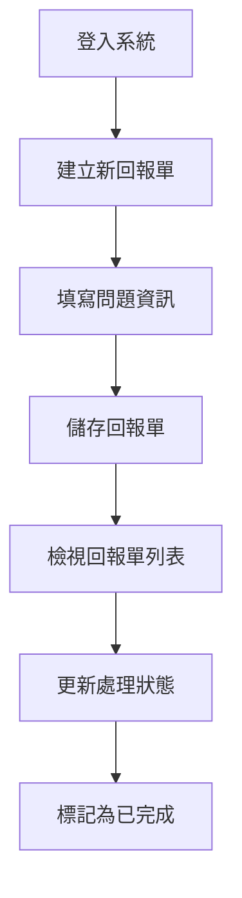

# ClarityDesk 使用者操作手冊

**版本**: 1.0  
**發佈日期**: 2025年10月21日  
**適用對象**: 所有 ClarityDesk 使用者

---

## 目錄

1. [系統簡介](#系統簡介)
2. [快速開始](#快速開始)
3. [登入系統](#登入系統)
4. [回報單管理](#回報單管理)
   - [檢視回報單列表](#檢視回報單列表)
   - [建立新回報單](#建立新回報單)
   - [檢視回報單詳情](#檢視回報單詳情)
   - [編輯回報單](#編輯回報單)
   - [刪除回報單](#刪除回報單)
   - [篩選與搜尋](#篩選與搜尋)
5. [系統管理功能](#系統管理功能-僅限管理人員)
   - [使用者權限管理](#使用者權限管理)
   - [問題所屬單位維護](#問題所屬單位維護)
6. [常見問題](#常見問題)
7. [聯絡支援](#聯絡支援)

---

## 系統簡介

ClarityDesk 是一個專為快速記錄與追蹤顧客問題而設計的管理系統。無論您是客服人員、技術支援還是業務人員,都可以透過簡潔直觀的介面,快速建立問題記錄並進行後續追蹤。

### 主要功能

- **快速記錄**: 透過簡化的表單快速建立顧客問題記錄
- **智慧篩選**: 支援多條件篩選,快速找到特定的回報單
- **狀態追蹤**: 清楚追蹤每個問題的處理進度
- **權限管理**: 管理人員可以管理使用者權限與系統設定
- **LINE 登入**: 使用 LINE 帳號快速登入,無需記憶額外帳號密碼

### 系統需求

- **瀏覽器**: Chrome、Firefox、Edge、Safari 最新兩個版本
- **網路**: 穩定的網際網路連線
- **LINE 帳號**: 需有有效的 LINE 帳號以進行登入

### 使用者角色

ClarityDesk 提供兩種使用者角色:

| 角色 | 權限說明 |
|------|----------|
| **普通使用者** | 可建立、檢視、編輯、刪除回報單,以及使用篩選功能 |
| **管理人員** | 除了普通使用者的所有權限外,還可管理使用者權限與問題所屬單位 |

---

## 快速開始

### 首次使用流程


1. 開啟 ClarityDesk 網站
2. 點擊「使用 LINE 登入」按鈕
3. 在 LINE 授權頁面點擊「同意」
4. 系統自動建立您的帳號並登入
5. 開始使用!

### 基本操作流程

一個典型的使用情境如下:



---

## 登入系統

### 使用 LINE 登入

1. **開啟登入頁面**
   - 訪問 ClarityDesk 網站首頁
   - 若尚未登入,系統會自動導向登入頁面

2. **進行 LINE 授權**
   - 點擊綠色的「使用 LINE 登入」按鈕
   - 瀏覽器會跳轉到 LINE 授權頁面

3. **同意授權**
   - 確認授權的權限項目
   - 點擊「同意」按鈕

4. **自動登入**
   - 首次登入:系統會自動建立您的帳號(預設為「普通使用者」角色)
   - 再次登入:直接登入並導向系統首頁

### 登入後的畫面

登入成功後,您會看到:

- **導航列**: 位於頁面頂端,包含主要功能選單
- **使用者資訊**: 右上角顯示您的 LINE 頭像與名稱
- **首頁**: 顯示最近的回報單統計資訊

### 登出系統

若需要登出系統:

1. 點擊右上角的使用者名稱或頭像
2. 選擇「登出」選項
3. 系統會清除登入狀態並導向登入頁面

---

## 回報單管理

回報單是 ClarityDesk 的核心功能,讓您可以快速記錄並追蹤顧客問題。

### 檢視回報單列表

1. **進入列表頁面**
   - 點擊導航列的「回報單管理」
   - 或直接從首頁點擊「檢視所有回報單」

2. **列表資訊**

   列表頁面會顯示所有回報單,包含以下資訊:

   | 欄位 | 說明 |
   |------|------|
   | 標題 | 問題的簡短標題 |
   | 緊急程度 | 以顏色標示 - 🔴高 / 🟠中 / 🟢低 |
   | 處理狀態 | 待處理 / 處理中 / 已完成 |
   | 回報人 | 建立此回報單的人員 |
   | 建立時間 | 回報單的建立日期與時間 |

3. **排序方式**
   - 預設按建立時間倒序排列(最新的在最上面)
   - 點擊欄位標題可切換排序方式

4. **分頁功能**
   - 每頁顯示 20 筆記錄
   - 使用頁面底部的分頁控制切換頁面

### 建立新回報單

#### 步驟一:進入建立頁面

1. 在回報單列表頁面點擊「新增回報單」按鈕
2. 或在導航列選擇「回報單管理」→「建立新回報單」

#### 步驟二:填寫表單

填寫以下必填欄位(標有 <span style="color: red;">*</span> 符號):

| 欄位名稱 | 說明 | 範例 |
|----------|------|------|
| **標題** * | 問題的簡短描述(50字以內) | 客戶反映商品包裝破損 |
| **內文** * | 問題的詳細說明(2000字以內) | 客戶於今日上午來電表示收到的商品外箱有明顯破損... |
| **紀錄日期** * | 問題發生或記錄的日期 | 2025/10/21 |
| **緊急程度** * | 選擇問題的緊急程度 | 高 / 中 / 低 |
| **處理狀態** * | 目前的處理進度 | 待處理(預設) |
| **問題所屬單位** * | 可選擇多個相關單位 | ☑ 客服部 ☑ 物流部 |
| **指派處理人員** * | 負責處理此問題的人員 | 從下拉選單選擇 |
| **回報人姓名** * | 記錄此問題的人員 | 王小明 |
| **顧客聯絡人姓名** * | 問題相關的顧客姓名 | 李大華 |
| **顧客連絡電話** * | 顧客的聯絡電話 | 0912-345-678 |

#### 欄位填寫說明

**緊急程度選擇建議**:

- **高 (🔴)**: 嚴重影響客戶使用或公司營運,需立即處理
  - 範例:服務中斷、資料遺失、客訴升級
- **中 (🟠)**: 有一定影響但可暫時因應,需盡快處理
  - 範例:功能異常、交貨延遲、一般客訴
- **低 (🟢)**: 影響較小,可依正常流程處理
  - 範例:功能優化建議、文件更新、一般諮詢

**問題所屬單位**:
- 可同時勾選多個單位
- 若不確定,建議選擇主要負責的單位

**指派處理人員**:
- 系統會依您選擇的單位,自動篩選該單位的處理人員
- 可選擇任一註冊使用者

#### 步驟三:儲存回報單

1. 填寫完所有必填欄位後,點擊「儲存」按鈕
2. 系統會進行以下驗證:
   - ✓ 必填欄位是否都已填寫
   - ✓ 電話格式是否正確
   - ✓ 日期格式是否有效
3. 驗證通過後,系統會:
   - 自動記錄建立時間
   - 顯示成功訊息
   - 導向回報單詳情頁面

#### 常見錯誤處理

| 錯誤訊息 | 原因 | 解決方法 |
|----------|------|----------|
| "標題為必填欄位" | 未填寫標題 | 請輸入問題的簡短描述 |
| "請選擇至少一個單位" | 未勾選問題所屬單位 | 至少勾選一個相關單位 |
| "電話格式不正確" | 電話格式不符 | 請輸入有效的電話號碼格式 |

### 檢視回報單詳情

#### 進入詳情頁面

1. 在回報單列表中,點擊任一回報單的標題
2. 或點擊該回報單列的「詳情」按鈕

#### 詳情頁面內容

詳情頁面以卡片式設計呈現,包含以下資訊區塊:

**1. 基本資訊卡片**
- 標題
- 緊急程度(彩色標籤顯示)
- 處理狀態(彩色標籤顯示)
- 建立時間
- 最後修改時間

**2. 問題描述卡片**
- 紀錄日期
- 完整問題內文

**3. 單位與人員卡片**
- 問題所屬單位列表
- 指派處理人員
- 回報人姓名

**4. 顧客資訊卡片**
- 顧客聯絡人姓名
- 顧客連絡電話

**5. 操作按鈕**
- 編輯:修改回報單資訊
- 刪除:移除此回報單
- 返回列表:回到回報單列表頁面

### 編輯回報單

#### 進入編輯模式

**方法一: 從詳情頁面**
1. 開啟回報單詳情頁面
2. 點擊「編輯」按鈕

**方法二: 從列表頁面**
1. 在回報單列表中
2. 點擊該回報單列的「編輯」按鈕

#### 修改資訊

1. 編輯頁面會顯示當前的所有資料
2. 修改您需要更新的欄位
3. 所有欄位的驗證規則與建立時相同

#### 儲存變更

1. 點擊「儲存」按鈕
2. 系統會:
   - 驗證所有欄位
   - 更新資料庫
   - 自動更新「最後修改時間」
   - 顯示成功訊息
   - 導向詳情頁面

#### 取消編輯

- 若不想儲存變更,點擊「取消」按鈕
- 系統會放棄所有修改並返回詳情頁面

### 刪除回報單

#### 刪除步驟

1. 開啟回報單詳情頁面
2. 點擊紅色的「刪除」按鈕
3. 系統會顯示確認對話框:
   ```
   ⚠️ 確認刪除
   
   您確定要刪除此回報單嗎?
   此操作無法復原。
   
   [取消]  [確定刪除]
   ```
4. 點擊「確定刪除」以執行刪除
5. 系統會:
   - 永久移除此回報單
   - 顯示成功訊息
   - 導向回報單列表頁面

#### 注意事項

⚠️ **重要提醒**:
- 刪除操作無法復原
- 建議在刪除前先確認是否有其他人正在處理此問題
- 若只是要暫時停止處理,建議改為修改處理狀態而非刪除

### 篩選與搜尋

#### 使用篩選功能

在回報單列表頁面,左側(桌面版)或頂部(手機版)有篩選面板:

**1. 處理狀態篩選**
```
☐ 待處理
☐ 處理中
☐ 已完成
```
- 可勾選一個或多個狀態
- 未勾選任何項目表示顯示所有狀態

**2. 緊急程度篩選**
```
☐ 高
☐ 中
☐ 低
```

**3. 問題所屬單位篩選**
```
☐ 客服部
☐ 技術部
☐ 業務部
(依系統設定的單位顯示)
```

**4. 指派處理人員篩選**
```
下拉選單:
- 全部人員
- 王小明
- 李小華
...
```

**5. 日期範圍篩選**
```
建立日期:
開始日期: [日期選擇器]
結束日期: [日期選擇器]
```

**6. 關鍵字搜尋**
```
搜尋: [________________] 🔍
```
- 可搜尋標題、內文、顧客姓名、電話等欄位

#### 套用篩選

1. 設定好篩選條件後
2. 點擊「套用篩選」按鈕
3. 系統會立即更新列表顯示
4. 符合條件的回報單會顯示在列表中
5. 頁面頂端會顯示目前的篩選條件

#### 清除篩選

- 點擊「清除篩選」按鈕
- 系統會移除所有篩選條件
- 顯示所有回報單

#### 篩選邏輯說明

- **同類條件**: 使用「或」邏輯(OR)
  - 例如:勾選「待處理」和「處理中」→ 顯示待處理**或**處理中的回報單
- **不同類條件**: 使用「且」邏輯(AND)
  - 例如:狀態選「待處理」+ 緊急程度選「高」→ 顯示待處理**且**緊急程度為高的回報單

#### 篩選範例

**範例 1: 查詢所有高優先級的待處理問題**
1. 處理狀態:勾選「待處理」
2. 緊急程度:勾選「高」
3. 點擊「套用篩選」

**範例 2: 查詢客服部本月的所有回報單**
1. 問題所屬單位:勾選「客服部」
2. 建立日期:設定本月第一天到今天
3. 點擊「套用篩選」

**範例 3: 搜尋特定客戶的所有問題**
1. 關鍵字搜尋:輸入客戶姓名或電話
2. 點擊搜尋按鈕 🔍

---

## 系統管理功能(僅限管理人員)

若您的帳號具有「管理人員」權限,導航列會顯示「系統管理」選單,包含以下功能:

- 使用者權限管理
- 問題所屬單位維護

### 使用者權限管理

#### 功能說明

此功能讓管理人員可以:
- 檢視所有註冊使用者的清單
- 變更使用者的權限角色
- 啟用或停用使用者帳號

#### 進入管理頁面

1. 點擊導航列的「系統管理」
2. 選擇「使用者權限管理」

#### 使用者清單

頁面會顯示所有註冊使用者的資訊:

| 欄位 | 說明 |
|------|------|
| 頭像 | 使用者的 LINE 頭像 |
| 顯示名稱 | 使用者的 LINE 顯示名稱 |
| Email | 使用者的電子郵件地址 |
| 目前角色 | 普通使用者 / 管理人員 |
| 帳號狀態 | 啟用 / 停用 |
| 註冊日期 | 帳號建立時間 |
| 操作 | 功能按鈕 |

#### 變更使用者權限

**步驟**:
1. 在使用者清單中找到目標使用者
2. 點擊「權限」欄位的下拉選單
3. 選擇新的角色:
   - 普通使用者
   - 管理人員
4. 系統會顯示確認對話框
5. 點擊「確認」以套用變更
6. 權限變更立即生效

**權限變更效果**:

| 變更類型 | 效果 |
|----------|------|
| 普通使用者 → 管理人員 | 該使用者下次操作時可看到「系統管理」選單 |
| 管理人員 → 普通使用者 | 該使用者下次操作時「系統管理」選單消失 |

#### 停用/啟用使用者

**停用使用者**:
1. 找到目標使用者
2. 點擊「停用」按鈕
3. 確認停用操作
4. 該使用者將無法登入系統
5. 但該使用者的歷史記錄與資料完整保留

**啟用使用者**:
1. 在篩選器勾選「顯示已停用使用者」
2. 找到已停用的使用者
3. 點擊「啟用」按鈕
4. 該使用者可再次登入系統

#### 注意事項

⚠️ **重要提醒**:
- 無法刪除使用者帳號,只能停用
- 停用使用者不會影響該使用者已建立的回報單
- 自己無法變更自己的權限
- 建議至少保留一位管理人員帳號

### 問題所屬單位維護

#### 功能說明

此功能讓管理人員可以:
- 新增、編輯、刪除問題所屬單位
- 為每個單位指派預設的處理人員
- 管理單位的啟用狀態

#### 進入管理頁面

1. 點擊導航列的「系統管理」
2. 選擇「問題所屬單位維護」

#### 單位清單

頁面會顯示所有問題所屬單位:

| 欄位 | 說明 |
|------|------|
| 單位名稱 | 單位的名稱 |
| 說明 | 單位的描述 |
| 狀態 | 啟用 / 停用 |
| 處理人員數量 | 指派給此單位的人員數量 |
| 建立時間 | 單位的建立日期 |
| 操作 | 編輯 / 刪除按鈕 |

#### 新增單位

**步驟**:
1. 點擊「新增單位」按鈕
2. 填寫單位資訊:
   - **單位名稱** *(必填)*: 例如「客服部」
   - **說明** (選填): 例如「處理客戶服務相關問題」
3. 點擊「儲存」

**驗證規則**:
- 單位名稱:2-50字
- 單位名稱不可重複
- 說明:最多200字

#### 編輯單位

**步驟**:
1. 在單位清單找到目標單位
2. 點擊「編輯」按鈕
3. 修改單位資訊:
   - 單位名稱
   - 說明
   - 狀態(啟用/停用)
4. **指派處理人員**:
   - 在「處理人員」區塊
   - 勾選要指派給此單位的使用者
   - 可複選多位人員
5. 點擊「儲存變更」

**處理人員指派說明**:
- 一個單位可以有多位處理人員
- 一位使用者可以被指派到多個單位
- 建議為每個單位至少指派一位處理人員

#### 刪除單位

ClarityDesk 使用「軟刪除」機制:

**步驟**:
1. 找到要刪除的單位
2. 點擊「刪除」按鈕
3. 系統顯示確認對話框:
   ```
   ⚠️ 確認停用單位
   
   此操作會將單位標記為「停用」,
   現有回報單仍會顯示此單位,
   但新回報單無法選擇此單位。
   
   [取消]  [確定停用]
   ```
4. 點擊「確定停用」

**軟刪除效果**:
- 單位狀態變更為「停用」
- 現有回報單仍顯示此單位名稱
- 建立新回報單時,此單位不會出現在選項中
- 可隨時重新啟用此單位

#### 重新啟用單位

**步驟**:
1. 在篩選器勾選「顯示已停用單位」
2. 找到已停用的單位
3. 點擊「編輯」按鈕
4. 將狀態改為「啟用」
5. 點擊「儲存變更」
6. 該單位會重新出現在回報單建立選項中

#### 檢視單位的回報單

**步驟**:
1. 在單位清單中
2. 點擊單位名稱或「檢視回報單」連結
3. 系統會導向回報單列表頁面
4. 自動套用該單位的篩選條件
5. 顯示所有屬於此單位的回報單

---

## 常見問題

### 登入相關

**Q1: 為什麼我無法登入?**

A: 請檢查以下項目:
1. 確認您的 LINE 帳號狀態正常
2. 檢查網路連線是否穩定
3. 清除瀏覽器快取後重試
4. 確認您的帳號未被管理員停用

**Q2: 我可以使用多個 LINE 帳號登入嗎?**

A: 每個 LINE 帳號對應一個 ClarityDesk 帳號。若要使用不同的 LINE 帳號,請先登出目前帳號。

**Q3: 登入狀態會保持多久?**

A: ClarityDesk 採用永久會話,您的登入狀態會一直保持,直到您手動登出。

### 回報單相關

**Q4: 我可以刪除其他人建立的回報單嗎?**

A: 是的,所有已登入使用者都可以檢視、編輯、刪除任何回報單。但請謹慎使用刪除功能,因為刪除操作無法復原。

**Q5: 如何更改回報單的處理狀態?**

A: 編輯回報單,在「處理狀態」欄位選擇新的狀態,然後儲存變更。

**Q6: 為什麼我的篩選結果是空的?**

A: 請檢查:
1. 篩選條件是否設定正確
2. 是否勾選了互相衝突的條件
3. 日期範圍是否有效
4. 嘗試清除篩選後重新設定

**Q7: 一個回報單可以指派給多位處理人員嗎?**

A: 目前系統設計為一個回報單指派一位主要處理人員,但可以選擇多個問題所屬單位,讓多個單位的人員都能看到此問題。

**Q8: 回報單的電話格式有什麼限制?**

A: 系統接受多種電話格式,包括:
- 手機:0912-345-678 或 0912345678
- 市話:02-12345678 或 0212345678
- 分機:02-1234-5678 #123

### 系統管理相關

**Q9: 我是管理人員,但看不到「系統管理」選單?**

A: 請嘗試:
1. 重新整理頁面(按 F5)
2. 登出後重新登入
3. 清除瀏覽器快取
4. 確認您的角色確實是「管理人員」

**Q10: 停用的單位還會出現在回報單中嗎?**

A: 已停用的單位:
- ✓ 會出現在現有回報單的資訊中
- ✗ 不會出現在建立新回報單的選項中

**Q11: 可以復原已刪除(停用)的單位嗎?**

A: 可以。管理人員可以透過「問題所屬單位維護」頁面,勾選「顯示已停用單位」,然後編輯該單位並將狀態改為「啟用」。

**Q12: 停用使用者後,他建立的回報單會消失嗎?**

A: 不會。停用使用者只會:
- 阻止該使用者登入
- 保留該使用者的所有歷史資料
- 該使用者的名稱仍會顯示在回報單中

### 技術相關

**Q13: 系統支援哪些瀏覽器?**

A: ClarityDesk 支援以下瀏覽器的最新兩個版本:
- Google Chrome
- Mozilla Firefox
- Microsoft Edge
- Apple Safari

**Q14: 可以在手機上使用嗎?**

A: 可以!ClarityDesk 採用響應式設計,可在手機、平板、桌機上正常使用。

**Q15: 我的資料安全嗎?**

A: ClarityDesk 採用以下安全措施:
- HTTPS 加密連線
- LINE OAuth 2.0 安全認證
- Azure SQL Database 資料加密
- 定期備份機制

**Q16: 系統有資料備份嗎?**

A: 是的,系統使用 Azure SQL Database,提供自動備份功能。詳細的備份政策請聯絡系統管理員。

### 效能相關

**Q17: 系統回應速度很慢怎麼辦?**

A: 若遇到效能問題,請嘗試:
1. 檢查網路連線品質
2. 關閉不必要的瀏覽器分頁
3. 清除瀏覽器快取
4. 減少篩選條件的數量
5. 聯絡技術支援

**Q18: 一次可以顯示多少筆回報單?**

A: 系統預設每頁顯示 20 筆記錄。若資料量過大,建議使用篩選功能縮小範圍。

---

## 聯絡支援

### 取得協助

如果您在使用 ClarityDesk 時遇到任何問題,可以透過以下方式取得協助:

#### 技術支援

- **Email**: support@claritydesk.com
- **服務時間**: 週一至週五 09:00-18:00
- **回應時間**: 24小時內

#### 問題回報

若您發現系統錯誤或有改善建議,請透過以下方式回報:

1. **GitHub Issues**
   - 訪問: https://github.com/Sen-CaPoo/ClarityDesk/issues
   - 建立新的 Issue
   - 詳細描述問題或建議

2. **Email 回報**
   - 收件者: support@claritydesk.com
   - 主旨: [問題回報] 或 [功能建議]
   - 內容請包含:
     - 您的使用者名稱
     - 問題發生的時間
     - 問題的詳細描述
     - 螢幕截圖(如適用)
     - 瀏覽器版本

#### 系統狀態

查詢系統是否正常運作:
- 系統狀態頁面: https://status.claritydesk.com (如有提供)

---

## 附錄

### 鍵盤快速鍵

ClarityDesk 支援以下鍵盤快速鍵(適用於桌面版):

| 快速鍵 | 功能 |
|--------|------|
| `Alt + N` | 建立新回報單 |
| `Alt + L` | 返回回報單列表 |
| `Alt + F` | 焦點移至搜尋框 |
| `Esc` | 關閉對話框或取消操作 |
| `Ctrl + S` | 儲存當前表單 |

### 緊急程度顏色標示

| 緊急程度 | 顏色 | 標籤樣式 |
|----------|------|----------|
| 高 | 紅色 | 🔴 高 |
| 中 | 橙色 | 🟠 中 |
| 低 | 綠色 | 🟢 低 |

### 處理狀態顏色標示

| 處理狀態 | 顏色 | 標籤樣式 |
|----------|------|----------|
| 待處理 | 灰色 | ⚪ 待處理 |
| 處理中 | 藍色 | 🔵 處理中 |
| 已完成 | 綠色 | 🟢 已完成 |

### 資料欄位限制

| 欄位 | 最小長度 | 最大長度 | 格式要求 |
|------|----------|----------|----------|
| 標題 | 1 字元 | 200 字元 | 純文字 |
| 內文 | 1 字元 | 5000 字元 | 純文字 |
| 回報人姓名 | 1 字元 | 100 字元 | 純文字 |
| 顧客聯絡人姓名 | 1 字元 | 100 字元 | 純文字 |
| 顧客連絡電話 | 8 字元 | 20 字元 | 數字、-、#、() |
| 單位名稱 | 2 字元 | 100 字元 | 純文字 |
| 單位說明 | 0 字元 | 500 字元 | 純文字 |

### 系統限制

- **同時上傳檔案**: 目前版本不支援檔案上傳
- **並發使用者數**: 建議同時在線人數 ≤ 50 人
- **資料保留期限**: 無期限(除非手動刪除)
- **備份頻率**: 每日自動備份

---

## 版本歷史

### v1.0 (2025-10-21)

**首次發佈**

功能包含:
- ✓ LINE Login 整合
- ✓ 回報單 CRUD 操作
- ✓ 多條件篩選功能
- ✓ 使用者權限管理
- ✓ 問題所屬單位維護
- ✓ 響應式網頁設計
- ✓ 商務白風格 UI

---

## 結語

感謝您使用 ClarityDesk!

我們致力於提供簡潔、高效的問題追蹤解決方案。若您有任何意見回饋或改善建議,歡迎隨時與我們聯繫。

**ClarityDesk 開發團隊**  
2025年10月21日

---

*本手冊會隨系統更新而修訂,最新版本請參考線上文件。*
